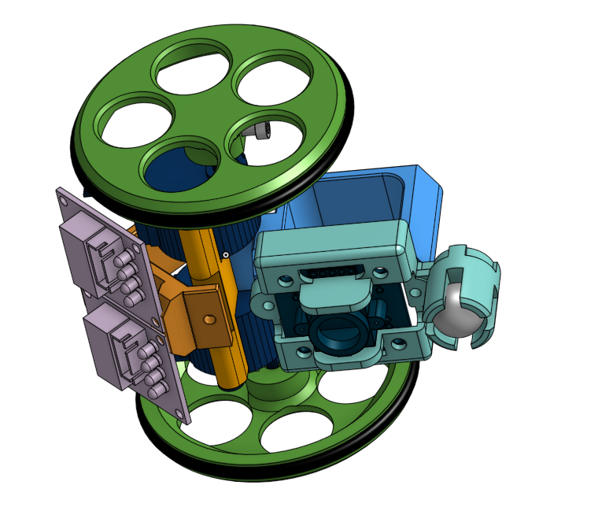
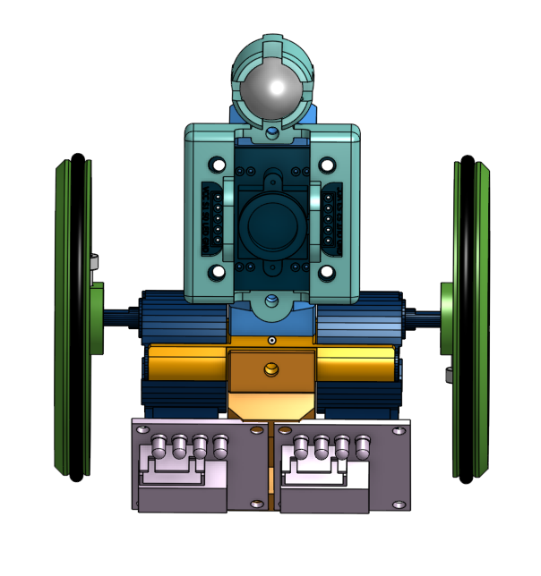
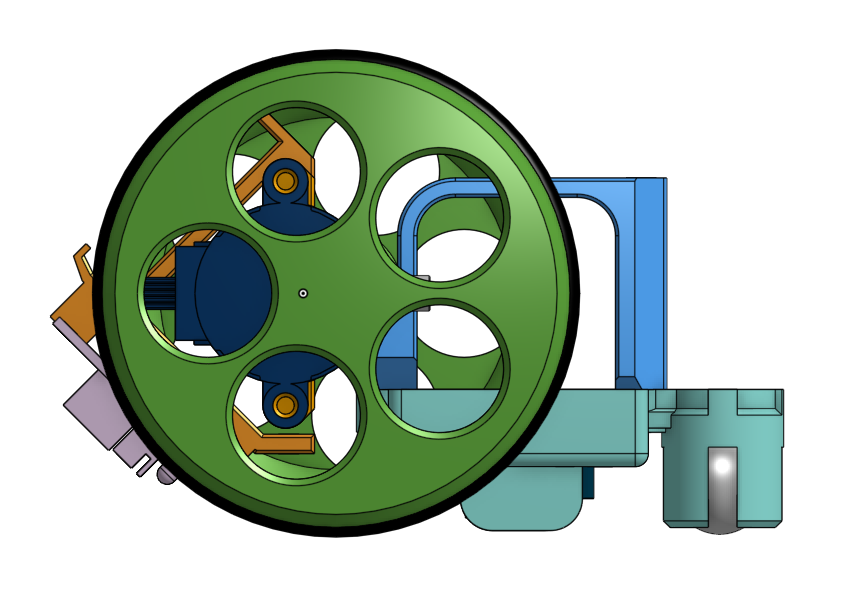

# EscornaColor
Version de Escronabot con sensor de color **TCS3200**.

El **sensor de color TCS3200** añade formatos de juego interesantes al famoso modelo de [**Escornabot**](https://escornabot.com/web/es).

Para usar el sensor de color, es necesario sustituir la pieza del alojamiento para la canica con el siguiente [modelo STL](https://www.thingiverse.com/thing:3934783) publicado en [Thingiverse](https://www.thingiverse.com/thing:3934783).

<p align="center">
	
	
	
</p>

El sensor tiene distintos pines, de los cuales los más importantes son el pin S2, S3 y OUT. El pin de LED nos servirá solamente para encender y apagar el módulo.
- S2 --> D11
- S3 --> D12
- OUT --> D13
- LED --> A6
- S0 --> VCC
- S1 --> VCC

Este sensor de color viene preparado para reconocer **8 colores** por defecto que son:

- BLANCO
- NEGRO
- ROJO
- VERDE
- AZUL
- AMARILLO
- NARANJA
- MARRON


# Programa tu EscornaColor.

Para desarrollar una programación personalizada de tu EscornaColor, solo tienes que registrar una función a cada movimiento y **programar tu robot con tus propias reglas**.

Te dejamos unos códigos de ejemplo para que puedas crear tu propio modelo de programación.

Existen dos funciones en caso de ganar ( **win()** ) y en caso de perder el juego ( **game_over()** ).
Puedes crear un modelo de juego en el que puedes perder vidas en función del color que el **EscornaColor** ha detectado. Si el **EscornaColor** llega al color objetivo sin perder todas las vidas ganas.
```cpp
Bot ESCORNABOT;
int lives = 2;

void red(){
  ESCORNABOT.win();
}

void green(){
  lives -= 1;
  Serial.print("Lives: ");Serial.println(lives);
  if (lives <= 0 ){
    ESCORNABOT.game_over();
    Serial.println("GAME OVER");
  }
}
```

También puedes programar los movimientos en función del color que has encontrado con la función **move( )**. Dentro del parámetro de esta función puedes definir los siguientes tipos de movimiento.

- MOVE_NONE
- MOVE_FORWARD
- MOVE_RIGHT
- MOVE_BACKWARD
- MOVE_LEFT
- MOVE_PAUSE
- MOVE_ALT_RIGHT
- MOVE_ALT_LEFT

```cpp
void white(){
  ESCORNABOT.move( MOVE_BACKWARD );
  Serial.println("COLOR White");
}

void black(){
  ESCORNABOT.move( MOVE_FORWARD );
  Serial.println("COLOR Black");
}
```
Ten cuidado, porque puedes caer facilmente en un bucle de movimientos si no piensas bien la secuencia.

Una vez finalizadas tus reglas de juego, deberás asociar una accion de color a cada color en el **setup** de tu programa. El bucle loop se encargará de todo-

```cpp
void setup()
{
    ESCORNABOT.init();
    ESCORNABOT.load_colortable();

    //Color Actions Define
    ESCORNABOT.color_action( WHITE , white );
    ESCORNABOT.color_action( BLACK , black );
    ESCORNABOT.color_action( RED , red );
    
    //GREEN change non consecutively
    ESCORNABOT.color_action( GREEN , green, true );
    //YELLOW need to change from consecutive yellow colors
    ESCORNABOT.color_action( YELLOW , yellow );
    
    //random movements for Blue color
    randomSeed(analogRead(5));
    ESCORNABOT.color_action( BLUE , blue );

    //Brown and Orange not working
    ESCORNABOT.color_action( BROWN , aux_void );
    ESCORNABOT.color_action( ORANGE , aux_void );
}

void loop()
{
    ESCORNABOT.loop();
}

//Auxiliar void function for every color action defined
void aux_void(){
  
}
```

Al final, solo tienes que cargar el código a tu robot y dejarlo funcionar con los objetivos que te has definido.

**IMPORTANTE:** Ten cuidado de no saturar la memoria. Si superas más del 85% de la memoria RAM pueden ocurrir errores, pero puedes jugártela. 

# Formatos de juego a desarrollar.

- [x] El **EscornaColor** tiene un número de vidas limitado. Los colores pueden quitar vidas. El objetivo es llegar vivo al objetivo.
- [ ] Cuando se alcanza un color, se ejecutan las acciones de movimiento hasta llegar al objetivo. Juego de la hormiga. [Hormiga de Langton Simplificado](https://es.wikipedia.org/wiki/Hormiga_de_Langton)

- [ ] A través de una aplicación se pueden ver los colores y movimientos del Escornabot. Sin mirar el tablero ni al EscornaColor hay que dibujar el tablero original.

- [ ] Programación libre de escornabot con distintas dinámicas en base a las lecturas del sensor de color.


El sensor de color requiere de una **calibración inicial** para poder clasificar los colores correctamente. 

# [Calibración del sensor de color TCS3200](http://blascarr.com/lessons/tcs3200-color-sensor-calibration/)

El **Escornacolor** está configurado por defecto para cargar la calibración almacenada en la **EEPROM** manteniendo presionado el botón delantero.

De la misma forma, el **Escornacolor** realizará una calibración manteniendo presionado el botón trasero.

Para realizar esta calibración hay que acceder al puerto serie y escribir un caracter **Y** o **N** para que vaya realizando calibraciones.
En cada calibración nos preguntarán si queremos guardar nuestra tabla de colores en la **EEPROM**. 

Esta calibración se puede realizar a través del **monitor serie** o por **Bluetooth** a través de una aplicación.

### Calibración de intensidades BLANCO - NEGRO
Primero hay que calibrar las lecturas con respecto el color negro **BLACK CALIBRATION** y al color blanco **WHITE CALIBRATION**, que establecen los límites de lectura del sensor. Esta calibración es muy importante para la calibración de nuestra **tabla de colores**. 

### Calibración de la **tabla de colores**
Acto seguido se requiere de una calibración de una tabla de **8 colores** que se almacenan en la **memoria EEPROM**.

Los dos primeros colores son el color **Blanco** y el color **Negro**, y las lecturas deben corresponder a los valores RGB **( 255, 255, 255 )** y **( 0, 0, 0 )** respectivamente.

El resto de colores será una combinación de estos valores RGB. 
**NOTA:** Los valores RGB de cada color debida a la calibración no tienen por qué corresponder exactamente con los valores RGB del color. Esta calibración es una aproximación para cada medida.

# Añade más colores a tu EscornaColor

WORK IN PROGRESS.

Se pueden añadir más colores, pero para ello, hay que tener en cuenta que exista una variación notable en las lecturas para colores .
Recomendamos utilizar variantes de colores facilmente diferenciables, ya que tonos similares pueden dar lugar a errores.

Por ejemplo, el blanco y el amarillo son muy similares. Si la lectura se hace en un punto medio entre dos colores, el resultado puedes ser indeterminado.


Esta extensión se basa en el desarrollo de una librería para módulos **TCS3200** accesible en el siguiente [enlace](https://github.com/blascarr/TCS3200-ColorSensor).

- Puedes aprender más sobre el color en esta [Introducción al color en robótica](http://blascarr.com/lessons/introduccion-al-color/)